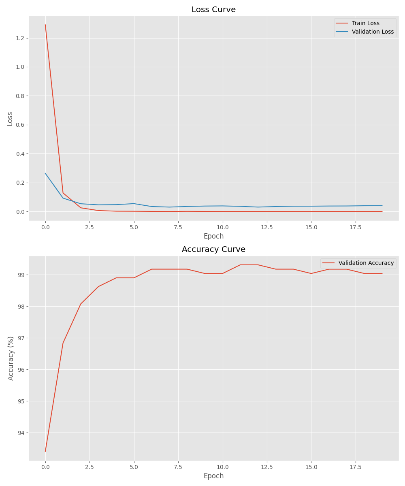
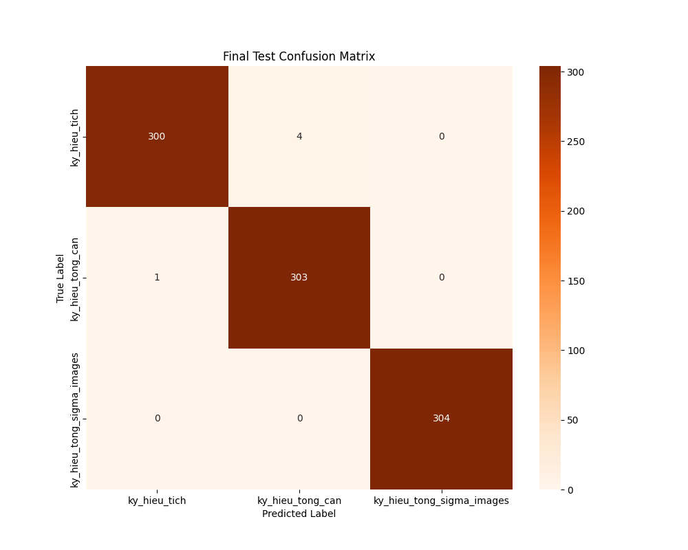

# Dự án Phân loại Ký hiệu Toán học

Dự án này xây dựng một mô hình Mạng Nơ-ron Tích chập (CNN) sử dụng PyTorch để phân loại hình ảnh của ba ký hiệu toán học cơ bản: **Căn bậc hai (√), Tổng Sigma (Σ), và Tích (Π)**.

<p align="center">
  
  
  
</p>

## Mục lục
- [Kiến trúc Thư mục](#kiến-trúc-thư-mục)
- [Quy trình thực thi](#quy-trình-thực-thi)
- [Kết quả](#kết-quả)
- [Hướng phát triển](#hướng-phát-triển)

---

## Kiến trúc Thư mục

Dự án tuân thủ cấu trúc tiêu chuẩn để đảm bảo tính module hóa, dễ bảo trì và tái sử dụng.

```
mathematical_formula_classification/
│
├── README.md               # File giới thiệu tổng quan dự án.
├── requirements.txt        # Danh sách các thư viện Python cần thiết.
├── assets/                 # Chứa các hình ảnh sử dụng trong README.
│
├── data/
│   ├── interim/            # Dữ liệu ảnh gốc (đã được cắt và chú thích).
│   └── processed/          # Dữ liệu đã qua xử lý, sẵn sàng cho mô hình.
│       ├── processed_image/  # Ảnh sau khi tiền xử lý (resize, grayscale, binarize).
│       ├── data_augmentation/ # Ảnh sau khi tăng cường dữ liệu.
│       ├── train/            # Dữ liệu huấn luyện (80% của data_augmentation).
│       └── test/             # Dữ liệu kiểm thử cuối cùng (20% của data_augmentation).
│
├── src/                    # Toàn bộ mã nguồn của dự án.
│   ├── Data_Augmentation/
│   │   └── augment_images.py # Script để tăng cường dữ liệu.
│   ├── dataset/
│   │   └── split_data.py     # Script chia dữ liệu thành tập train/test.
│   ├── models/
│   │   ├── model.py          # Định nghĩa kiến trúc mô hình CNN.
│   │   ├── train_model.py    # Script huấn luyện và kiểm định (validation) model.
│   │   └── test_model.py     # Script đánh giá model cuối cùng trên tập test.
│   └── preprocessing_data/
│       └── preprocess_images.py # Script tiền xử lý ảnh.
│
├── models/                 # Nơi lưu các file model đã huấn luyện.
│   ├── best_model.pth      # Model có độ chính xác validation cao nhất.
│   └── checkpoints/        # Các checkpoint của model được lưu sau mỗi epoch.
│
└── reports/                # Chứa các báo cáo và biểu đồ được tạo tự động.
    ├── figures/            # Các file hình ảnh (biểu đồ, ma trận nhầm lẫn).
    └── final_test_results/ # Báo cáo hiệu suất cuối cùng trên tập test.
```

---

## Quy trình thực thi

Để tái tạo lại toàn bộ quy trình từ đầu đến cuối, hãy thực hiện các lệnh sau theo đúng thứ tự.

### 1. Cài đặt môi trường
Đảm bảo bạn đã cài đặt Python 3.8+ và sau đó cài đặt các thư viện cần thiết:
```bash
pip install -r requirements.txt
```

### 2. Tiền xử lý ảnh
Script này sẽ lấy ảnh từ `data/interim`, đồng nhất kích thước thành 512x512 (với padding), chuyển sang ảnh xám và nhị phân hóa. Kết quả được lưu vào `data/processed/processed_image`.
```bash
python src/preprocessing_data/preprocess_images.py
```

### 3. Tăng cường dữ liệu
Script này đọc các ảnh đã được tiền xử lý và tạo ra 10 phiên bản biến đổi cho mỗi ảnh (xoay, dịch chuyển, biến dạng đàn hồi) để tăng sự đa dạng của dữ liệu. Kết quả được lưu vào `data/processed/data_augmentation`.
```bash
python src/Data_Augmentation/augment_images.py
```

### 4. Chia dữ liệu
Script này sẽ cân bằng số lượng ảnh giữa các lớp và chia bộ dữ liệu đã tăng cường thành hai tập: `train` (80%) và `test` (20%).
```bash
python src/dataset/split_data.py
```

### 5. Huấn luyện Mô hình
Script này sẽ huấn luyện mô hình CNN. Nó sử dụng 80% của tập `train` để huấn luyện và 20% còn lại để kiểm định (validation) sau mỗi epoch. Checkpoint sẽ được lưu sau mỗi epoch và model tốt nhất (dựa trên validation accuracy) sẽ được lưu vào `models/best_model.pth`.
```bash
python src/models/train_model.py
```

### 6. Đánh giá cuối cùng
Sau khi quá trình huấn luyện hoàn tất, chạy script này để đánh giá hiệu suất của model tốt nhất trên tập `test` (dữ liệu mà model chưa từng thấy). Script sẽ tạo ra một bộ báo cáo chi tiết trong `reports/final_test_results/`.
```bash
python src/models/test_model.py
```
---

## Kết quả

Sau khi chạy các script huấn luyện và kiểm thử, các báo cáo hiệu suất sẽ được tạo ra. Dưới đây là ví dụ về các kết quả bạn sẽ nhận được.

*(Lưu ý: Các số liệu và biểu đồ dưới đây là **ví dụ minh họa**. Kết quả thực tế sẽ được tạo trong thư mục `reports/` sau khi bạn chạy mã.)*

### Báo cáo Phân loại (Tập Test)
Báo cáo này cung cấp các chỉ số chi tiết cho từng lớp. Nó sẽ được lưu dưới dạng file `final_classification_report.csv`.

| Lớp                        | precision | recall | f1-score | support |
|----------------------------|-----------|--------|----------|---------|
| ky_hieu_tich               | 0.9x      | 0.9x   | 0.9x     | 293     |
| ky_hieu_tong_can           | 0.9x      | 0.9x   | 0.9x     | 293     |
| ky_hieu_tong_sigma_images  | 0.9x      | 0.9x   | 0.9x     | 293     |
| **accuracy**               |           |        | **0.9x** | **879** |
| **macro avg**              | 0.9x      | 0.9x   | 0.9x     | 879     |
| **weighted avg**           | 0.9x      | 0.9x   | 0.9x     | 879     |

### Biểu đồ Huấn luyện
Biểu đồ này cho thấy sự thay đổi của `Loss` và `Accuracy` qua các `epoch` trên cả tập huấn luyện và tập kiểm định. Nó giúp đánh giá xem mô hình có bị *overfitting* hay không.
*(Hình ảnh được lấy từ `reports/figures/training_validation_curves.png`)*



### Ma trận Nhầm lẫn (Confusion Matrix)
Ma trận này trực quan hóa các lỗi của mô hình, cho thấy lớp nào thường bị nhầm lẫn với lớp nào.
*(Hình ảnh được lấy từ `reports/final_test_results/final_confusion_matrix.png`)*



---

## Hướng phát triển
- Thử nghiệm các kiến trúc CNN phức tạp hơn (ví dụ: ResNet, EfficientNet) để cải thiện độ chính xác.
- Tinh chỉnh các tham số (hyperparameters) như `learning_rate`, `batch_size` hoặc các kỹ thuật trong `Data Augmentation`.
- Phát triển khả năng tự động hóa và đóng gói mô hình.
